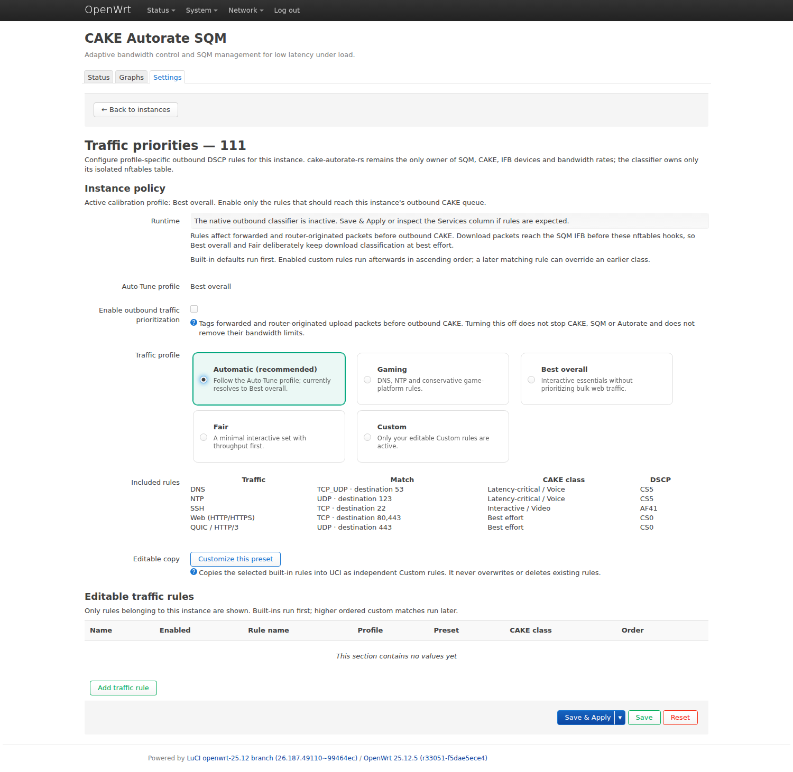
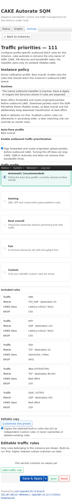
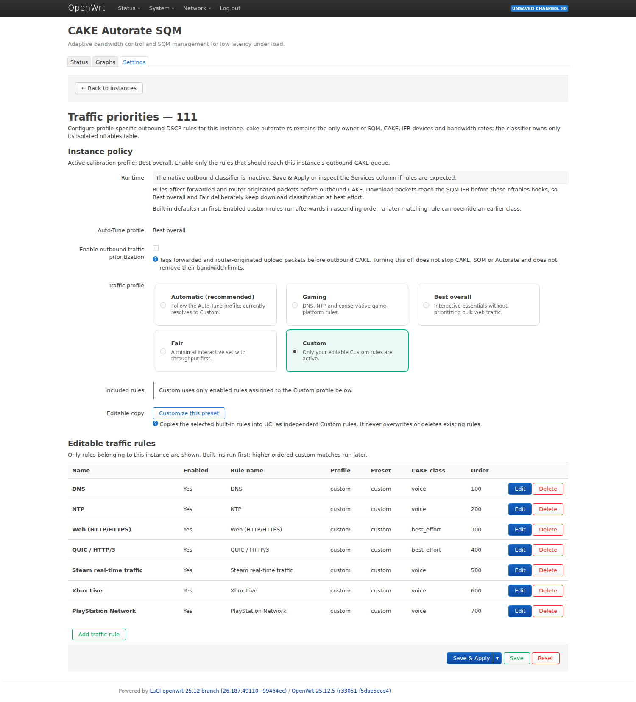

# Profile traffic priorities

CAKE Autorate RS includes an optional native outbound DSCP classifier for the
Gaming, Best overall, and Fair profiles. It borrows the useful configuration
idea from traffic-classification frontends—named presets plus editable
per-profile rules—but it does **not** integrate with qosify or eBPF.

The ownership boundary is strict:

- `cake-autorate-rs` remains the only owner of the managed CAKE qdiscs, IFB
  devices, ingress redirects, and bandwidth rates;
- the classifier owns only `table inet cake_autorate_dscp`;
- it never creates, replaces, changes, or removes a qdisc;
- it never writes a CAKE bandwidth value;
- stopping CAKE Autorate removes its private nftables table.

## Where classification applies

Rules run for forwarded and router-originated packets leaving the selected
uplink. They match the resolved L3 device with `oifname`, reset outbound DSCP
to CS0, apply the active profile defaults, and finally apply enabled custom
rules in ascending order.

An OpenWrt SQM download queue is different: WAN ingress is redirected to its
IFB by `tc` before the normal nftables forwarding hooks. The native outbound
classifier therefore cannot retroactively classify those download packets.
Best overall and Fair deliberately use best-effort plus `wash` on the download
CAKE queue while allowing `diffserv4` on upload. Gaming can preserve trusted
WAN-ingress DSCP, but locally created profile rules still affect upload only.
Enabling them deliberately replaces pre-existing upload markings: outbound
DSCP is reset to CS0 first, then matching built-in and custom rules assign the
selected class.

This limitation is intentional. The project does not add a qosify service, an
eBPF/tc classifier, or a second CAKE owner merely to claim bidirectional
classification.

## Built-in profile defaults

| Profile | Built-in rule | CAKE class |
|---|---|---|
| Gaming | DNS, NTP | Voice / CS5 |
| Gaming | Steam real-time UDP, Xbox Live UDP, PlayStation Network UDP | Voice / CS5 |
| Gaming | HTTP/HTTPS and QUIC | Best effort / CS0 |
| Best overall | DNS, NTP | Voice / CS5 |
| Best overall | SSH | Interactive / AF41 |
| Best overall | HTTP/HTTPS and QUIC | Best effort / CS0 |
| Fair | DNS, NTP | Interactive / AF41 |
| Fair | HTTP/HTTPS and QUIC | Best effort / CS0 |

The editor presents one exclusive traffic profile:

- **Automatic (recommended)** follows the instance's current Auto-Tune
  profile;
- **Gaming**, **Best overall**, and **Fair** pin traffic policy independently
  of future Auto-Tune runs;
- **Custom** runs only the editable rules assigned to Custom.

Hovering a profile card previews its exact matches, classes and DSCP values;
selecting it keeps the preview open for touch and keyboard users. The preview
comes from the same catalog that generates the nftables rules, so the UI and
runtime do not maintain two copies of the presets. The presets are
intentionally small; they are starting policy, not a claim that every game or
application uses a permanent universal port list.

Desktop profile selection and the rule preview:

[](docs/screenshots/traffic-priorities-desktop.png)

On a narrow screen the same fields become labelled cards rather than a
horizontally compressed table:

[](docs/screenshots/traffic-priorities-mobile.png)

## Custom rules

Open **Network → CAKE Autorate SQM → Settings** and select **Traffic
priorities** on the intended instance row. The action is deliberately placed
before **Re-run Auto-Tune**, **Edit**, and **Delete**. There is no global
Traffic priorities tab: the URL carries a validated instance identifier, the
status call is scoped to that instance, and the editor exposes only rules that
belong to it.

A custom rule has:

- an instance and one profile;
- an enabled flag and display name;
- a preset or explicit TCP/UDP/ICMP protocol;
- optional source/destination ports;
- optional source/destination IPv4 or IPv6 address/prefix;
- one CAKE class: Voice/CS5, Interactive/AF41, Best effort/CS0, or
  Background/CS1;
- an order from 0 through 9999.

Built-in rules run first. Custom rules then run from the lowest order to the
highest, so a later matching rule can deliberately override an earlier one.
Rules assigned to Gaming, Best overall, or Fair supplement that profile.
Rules assigned to Custom are active only in Custom mode. Inactive profile
groups stay saved and visible; switching profiles never deletes them.

**Customize this preset** creates an explicit Custom copy of the currently
shown built-in rules with editable protocol and port fields. It stages the copy
as normal LuCI/UCI pending changes, switches the instance to Custom, and still
requires **Save & Apply**. It never commits automatically, overwrites an
existing Custom group, or deletes another profile's rules. Because the copy is
ordinary UCI data, package upgrades do not rewrite it.

[](docs/screenshots/traffic-priorities-custom.png)

All values pass closed allowlists and nftables validation; no UCI value is
executed as shell text.

A legacy or manually written rule without `option profile` is treated as
Custom and remains inactive under Automatic or any pinned built-in profile.
This fail-safe default prevents a malformed rule from following profile
changes; opening and saving it in LuCI writes the explicit Custom value.

Example UCI rule:

```uci
config traffic_rule
	option enabled '1'
	option name 'Console'
	option instance 'wan_sqm'
	option profile 'gaming'
	option preset 'custom'
	option family 'ipv4'
	option protocol 'udp'
	option source_network '192.168.1.50/32'
	option destination_ports '3074,3478-3480'
	option class 'voice'
	option order '200'
```

## Activation and safety checks

Rules are installed only when all of these are true for the instance:

1. autorate and its managed SQM queue are enabled;
2. traffic rules are enabled;
3. the SQM script is `layer_cake.qos`;
4. upload CAKE is configured with `diffserv4`;
5. no other enabled instance claims the same resolved uplink.

Turning **Enable outbound traffic prioritization** off disables only this
classifier. It does not stop Autorate or SQM, remove CAKE/IFB, or remove the
bandwidth limits owned by the instance.

The helper validates the complete nftables transaction before atomically
replacing its private table. After apply it hashes the actual JSON ruleset and
stores a RAM-only manifest binding each instance to its resolved interface,
Auto-Tune profile, configured traffic-profile mode, and resolved traffic
profile. The **Uplink / state** column shows both profiles explicitly, for
example `Auto-Tune: Gaming` and `Priorities: Gaming · linked`. The mandatory
**Services** column reports:

- `ACTIVE` when the table, checksum, instance, interface, profile, and upload
  `diffserv4` queue agree;
- `MISSING` when expected rules are absent;
- `INEFFECTIVE` when upload CAKE cannot consume the classes;
- `DRIFTED` when the private table or its binding changed;
- `ORPHANED` when rules remain for a disabled instance.

The manifest lives under `/var/run`, is never written to flash, and disappears
on stop or reboot.

## Upgrade compatibility

The service performs a one-time, idempotent migration when an existing
instance has no `traffic_profile` option. An enabled or absent legacy defaults
flag becomes `traffic_profile=auto`. If the active profile's legacy defaults
flag was explicitly disabled, that instance becomes `traffic_profile=custom`
and only the rules belonging to that formerly active profile move to Custom.
Rules saved for inactive profiles remain untouched. The separate
`traffic_rules_enabled` opt-in is never enabled by migration.

## Multi-WAN

Rules are rendered independently for every enabled instance and match only its
resolved L3 uplink. Two instances cannot claim the same target. A profile
change on one WAN does not copy rules or learned state to another WAN, and the
configuration fingerprint binds the relevant custom rules into Full
Auto-Tune/Scheduled Auto-Apply evidence.

Opening one WAN's editor never places another WAN in the instance selector or
rule list. This UI isolation complements the backend ownership and fingerprint
checks; it is not the sole security boundary.

The classifier changes DSCP only. Main-table or mwan3 route selection remains
the responsibility of the existing structured probe router, and CAKE/IFB/rate
ownership remains with the corresponding autorate instance.
